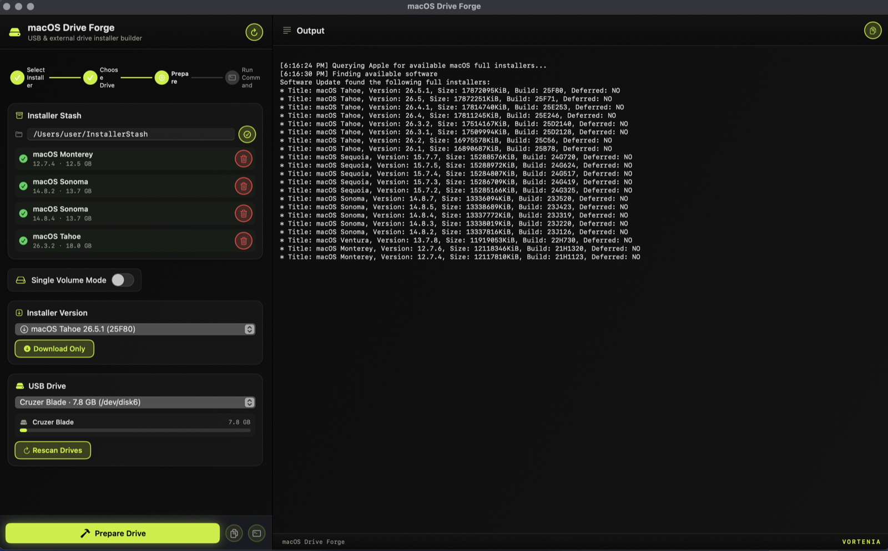

# macOS Drive Forge

Put multiple macOS installers on a single USB stick or external drive.



## What it is

macOS Drive Forge is a native macOS app for building bootable macOS installer drives. Its standout feature: it can place **several macOS versions on one drive** (for example Sonoma, Sequoia, and Tahoe side by side), so a single USB stick or external hard drive can reinstall or boot any of them. It also handles the everyday single-installer job, without making you memorize `createinstallmedia` flags.

It works with **any external disk macOS can erase and boot from**: USB flash drives, USB-C/Thunderbolt SSDs, and external hard drives. Bigger external drives are ideal for carrying many installers at once.

Under the hood it drives Apple's own tools (`softwareupdate`, `diskutil`, `createinstallmedia`) behind a simple interface:

- **Multi-volume drives.** Split one USB stick or external drive into several bootable installer volumes, one macOS version each.
- **Single bootable drive.** Flash any one installer to a drive.
- **Browse and download** any Apple full installer (Sonoma, Sequoia, Tahoe, ...) straight from Apple.
- **Local installer stash** (`~/InstallerStash` by default), labeled by macOS name, so you don't re-download.
- **Live progress**, a workflow indicator, and drive-capacity bars as you go.

## Who it's for

Technicians, IT admins, refurbishers, repair shops, and home labs: anyone who reinstalls or boots multiple Macs and wants one drive that carries every macOS version they need, instead of a drawer full of single-version sticks.

## Requirements

- macOS 14 (Sonoma) or later
- [Swift toolchain](https://www.swift.org/install/macos/) 6.2+ (Xcode 16+ or the Swift command-line tools)
- An external USB stick or hard drive (allow 16 GB or more per installer volume; a larger external drive fits more versions)
- Administrator (`sudo`) access, since erasing and writing a drive requires it

## Running it

### Build and run from source

From the macOS Drive Forge source directory:

```bash
swift run DriveForge
```

### Clickable launcher

Double-click **`Run-Drive-Forge.command`**. On first run it builds a release binary, assembles `macOS Drive Forge.app`, and opens it.

> macOS may block an unsigned app the first time. If so, right-click the app, choose **Open**, then confirm.

## Safety

macOS Drive Forge **erases the target drive** before writing an installer to it (`diskutil eraseDisk` then `createinstallmedia`). Double-check that you've selected the right external disk, because the operation is destructive and cannot be undone. The app lists only external, physical drives to reduce the risk of touching your boot disk, and it runs the destructive step in Terminal so you can review the exact command before authorizing it with your password.

## License

[MIT](LICENSE) © Vortenia

A [Vortenia](https://vortenia.com) tool.
